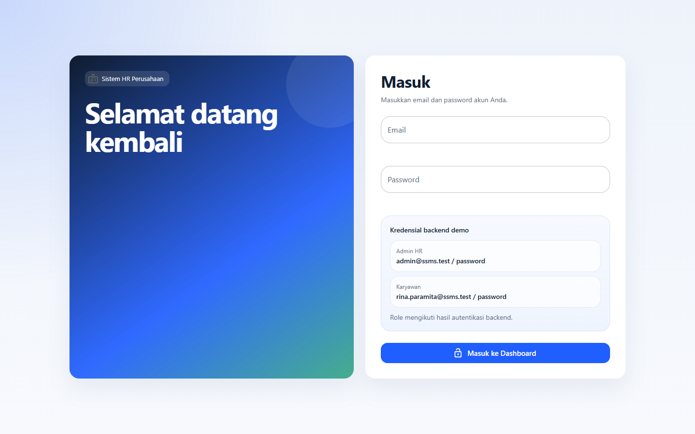
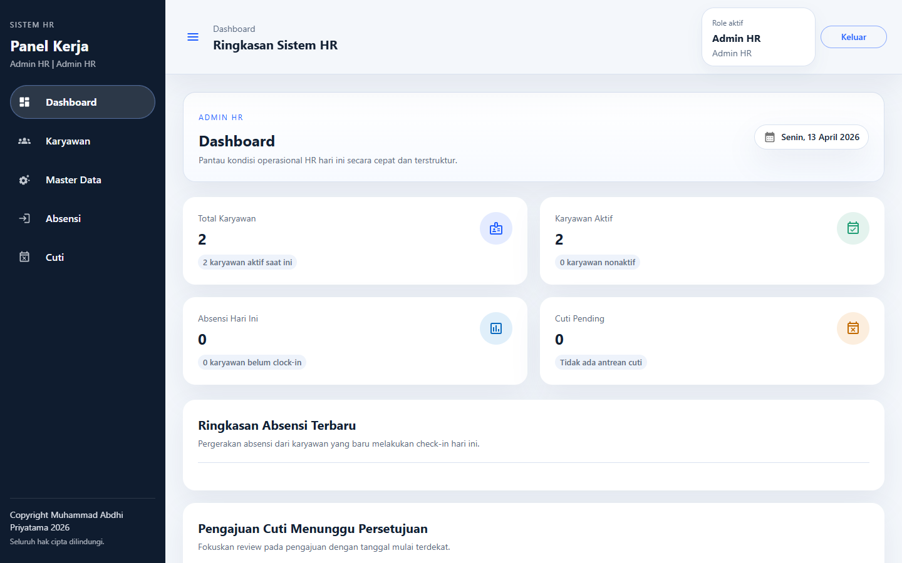
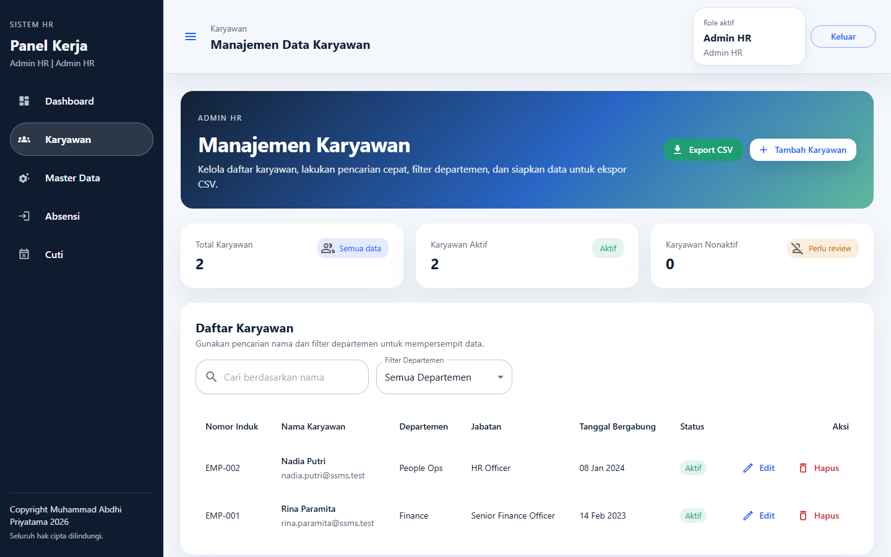
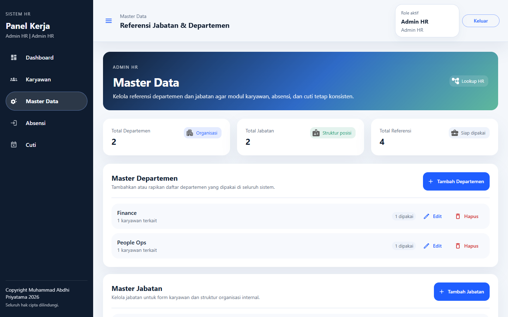
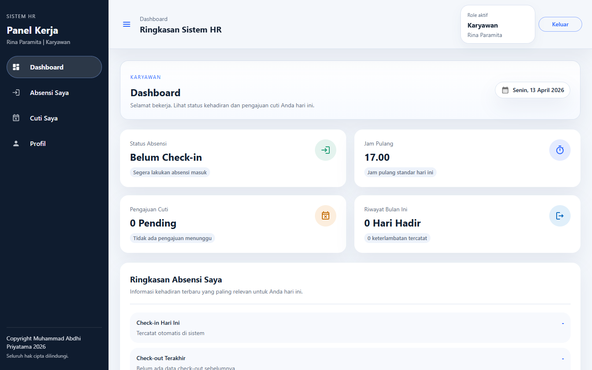
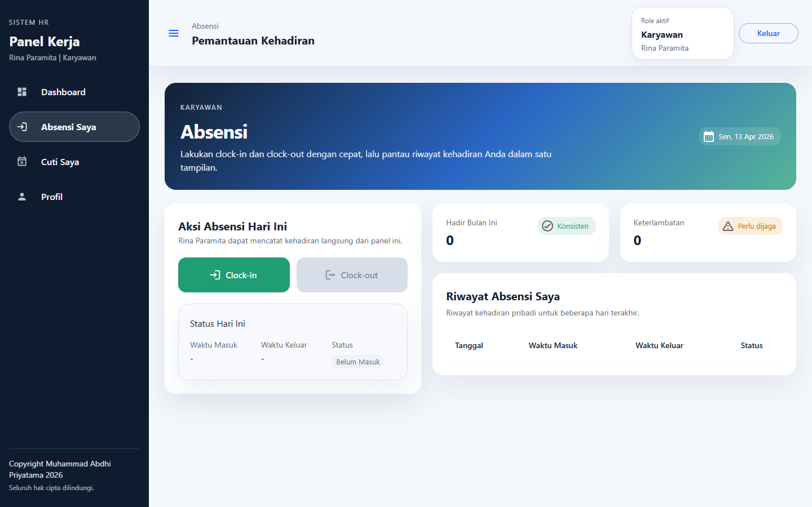
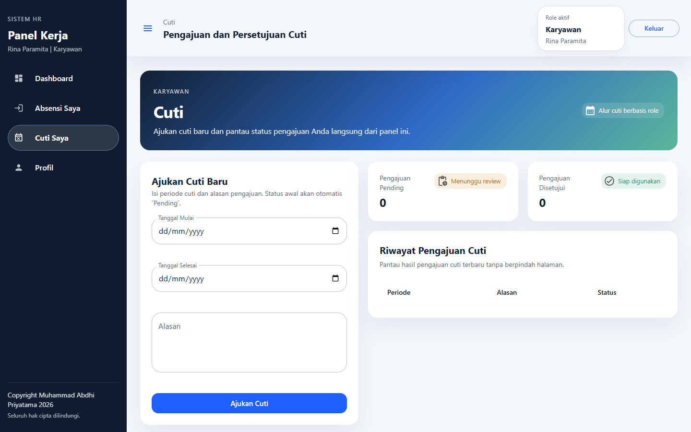

# Sistem Manajemen HR (HRMS) Perusahaan

Sistem Manajemen HR adalah aplikasi full-stack berbasis React dan Laravel yang dirancang untuk mendukung operasional HR internal perusahaan. Fitur yang tersedia mencakup pengelolaan karyawan, absensi, cuti, dan master data perusahaan. Arsitektur proyek dipisahkan menjadi backend sebagai penyedia REST API dan frontend sebagai Single Page Application (SPA).

## Daftar Isi

- [Unduh Repository](#unduh-repository)
- [Fitur Utama](#fitur-utama)
- [Dokumentasi dan Screenshot](#dokumentasi-dan-screenshot)
- [Instalasi dan Setup](#instalasi-dan-setup)
- [Menjalankan Secara Lokal](#menjalankan-secara-lokal)
- [Dokumentasi API Ringkas](#dokumentasi-api-ringkas)
- [Role-Based Access Control (RBAC)](#role-based-access-control-rbac)
- [Pengujian](#pengujian)
- [Panduan Deployment](#panduan-deployment)

## Unduh Repository

Sebelum melakukan setup backend dan frontend, unduh repository ini melalui terminal:

```bash
git clone https://github.com/abdhi2202/sistem-hr-perusahaan.git
cd sistem-hr-perusahaan
```

Setelah proses clone selesai, lanjutkan ke tahap instalasi dan konfigurasi proyek.

---

## Fitur Utama

- **Authentication dan Authorization**: Login berbasis token dengan Laravel Sanctum serta pengaturan hak akses berbasis peran.
- **Dashboard Statistik**: Menampilkan ringkasan total karyawan, karyawan aktif, absensi hari ini, dan jumlah pengajuan cuti yang masih menunggu persetujuan.
- **Manajemen Karyawan**: Mendukung operasi CRUD, pencarian data, dan filter berdasarkan departemen.
- **Master Data**: Mengelola data departemen dan jabatan perusahaan.
- **Modul Absensi**: Menyediakan fitur *clock-in*, *clock-out*, dan riwayat absensi harian.
- **Modul Cuti**: Karyawan dapat mengajukan cuti, sedangkan admin dapat menyetujui atau menolak pengajuan.
- **Ekspor Data**: Mengunduh rekap data karyawan dan absensi dalam format CSV.

---

## Dokumentasi dan Screenshot

### Halaman Login

Halaman autentikasi utama untuk seluruh pengguna sistem.

| Halaman | Keterangan | Screenshot |
|---------|------------|------------|
| **Login** | Form masuk ke sistem. Secara default, field login dibiarkan kosong untuk menjaga keamanan. |  |

### Tampilan Admin HR

Bagian ini digunakan oleh pengguna dengan peran `admin_hr` untuk mengelola seluruh data operasional perusahaan.

| Halaman | Keterangan | Screenshot |
|---------|------------|------------|
| **Dashboard Admin** | Menampilkan ringkasan statistik operasional, jumlah karyawan, serta status cuti dan absensi secara menyeluruh. |  |
| **Manajemen Karyawan** | Menampilkan daftar karyawan lengkap dengan fitur CRUD, pencarian, dan filter departemen. |  |
| **Master Data** | Digunakan untuk mengelola data statis seperti departemen dan jabatan dalam struktur organisasi. |  |

### Tampilan Karyawan

Bagian ini ditujukan bagi pengguna dengan peran `karyawan` untuk mendukung kebutuhan administrasi harian secara mandiri.

| Halaman | Keterangan | Screenshot |
|---------|------------|------------|
| **Dashboard Karyawan** | Menampilkan sambutan personal dan ringkasan riwayat absensi terbaru milik pengguna. |  |
| **Absensi Mandiri** | Antarmuka untuk melakukan *clock-in* dan *clock-out* harian. |  |
| **Pengajuan Cuti** | Form pengajuan cuti sekaligus halaman pemantauan status persetujuan dari HR. |  |

---

## Instalasi dan Setup

Bagian ini merupakan ringkasan konfigurasi umum. Jika Anda ingin langsung menjalankan aplikasi secara lokal menggunakan SQLite dan akun demo, ikuti panduan pada bagian [Menjalankan Secara Lokal](#menjalankan-secara-lokal).

### Alur yang Direkomendasikan

Untuk penggunaan lokal yang siap dipakai segera setelah repository di-clone, gunakan panduan pada bagian **Menjalankan Secara Lokal**. Panduan tersebut sudah menyesuaikan hal berikut:

- Backend menggunakan SQLite lokal.
- Frontend terhubung ke `http://localhost:8000`.
- Akun demo dapat langsung digunakan setelah proses seeding selesai.

---

## Menjalankan Secara Lokal

Panduan ini ditujukan agar aplikasi dapat langsung dicoba secara lokal dalam kondisi siap pakai setelah repository di-clone.

Catatan penting:

- File `.env` backend yang ada di repository ini dapat mengarah ke layanan hosting eksternal.
- Untuk pengujian lokal yang aman, jalankan backend dengan environment sementara melalui PowerShell agar menggunakan SQLite lokal.
- Frontend pada repository ini telah diarahkan ke backend lokal melalui `VITE_DATA_SOURCE=http` dan `VITE_API_BASE_URL=http://localhost:8000`.

### Prasyarat

Pastikan perangkat Anda telah memiliki:

- PHP `>= 8.2`
- Composer
- Node.js dan npm
- Ekstensi PHP `pdo_sqlite`

### 1. Jalankan Backend Lokal

Buka **Terminal PowerShell pertama**, lalu jalankan:

```powershell
cd "C:\Users\User\Documents\sistem-hr-perusahaan\sistem-hr-backend"
composer install

$env:APP_ENV='local'
$env:APP_DEBUG='true'
$env:APP_URL='http://localhost:8000'
$env:DB_CONNECTION='sqlite'
$env:DB_DATABASE='C:\Users\User\Documents\sistem-hr-perusahaan\sistem-hr-backend\database\database.sqlite'
$env:DB_URL=''
$env:SESSION_DRIVER='database'
$env:CACHE_STORE='database'
$env:QUEUE_CONNECTION='database'
$env:CORS_ALLOWED_ORIGINS='http://localhost:5173,http://127.0.0.1:5173'
$env:CORS_ALLOWED_ORIGINS_PATTERNS=''

php artisan migrate:fresh --seed
php artisan serve
```

Keterangan:

- `php artisan migrate:fresh --seed` akan menyiapkan ulang database SQLite lokal beserta akun demo.
- Jika Anda tidak ingin mereset data lokal yang sudah ada, gunakan `php artisan migrate --seed`.
- Backend akan berjalan di `http://localhost:8000`.

### 2. Jalankan Frontend Lokal

Buka **Terminal PowerShell kedua**, lalu jalankan:

```powershell
cd "C:\Users\User\Documents\sistem-hr-perusahaan\sistem-hr"
npm install
npm run dev
```

Frontend akan berjalan di:

```text
http://localhost:5173
```

### 3. Login dan Uji Aplikasi

Setelah backend dan frontend aktif:

1. Buka `http://localhost:5173`.
2. Login menggunakan salah satu akun demo berikut.

**Akun demo bawaan:**

- Admin HR: `admin@ssms.test` / `password`
- Karyawan: `rina.paramita@ssms.test` / `password`

### 4. Catatan Saat Demo Lokal

- Jika muncul peringatan PHP seperti `Module "ftp" is already loaded`, hal tersebut hanya terkait konfigurasi PHP lokal dan bukan indikasi kegagalan aplikasi.
- Selama backend dijalankan menggunakan environment PowerShell di atas, aplikasi akan memakai database SQLite lokal, bukan database hosting.
- Dengan alur ini, siapa pun yang melakukan clone repository dapat langsung menjalankan aplikasi lokal dan melihat tampilan yang siap digunakan untuk demo.

---

## Dokumentasi API Ringkas

Seluruh endpoint API berada di bawah prefix `/api`. Gunakan header `Authorization: Bearer <token>` untuk endpoint yang dilindungi.

### 1. Autentikasi

- **POST** `/api/login`: Melakukan login dan mengembalikan Bearer token.

  Contoh body request:

  ```json
  {
    "email": "admin@ssms.test",
    "password": "password"
  }
  ```

- **POST** `/api/logout`: Mengakhiri sesi aktif.

### 2. Absensi

- **POST** `/api/absensi/clock-in`: Mencatat waktu masuk.
- **POST** `/api/absensi/clock-out`: Mencatat waktu keluar.
- **GET** `/api/absensi/riwayat`: Mengambil riwayat absensi yang difilter sesuai peran pengguna.

### 3. Pengajuan Cuti

- **POST** `/api/cuti/ajukan`: Membuat pengajuan cuti baru.
- **GET** `/api/cuti`: Menampilkan daftar atau riwayat pengajuan cuti.
- **POST** `/api/cuti/approve/{id}`: Menyetujui atau menolak pengajuan cuti oleh admin.

### 4. Manajemen dan Master Data

- **GET/POST/PUT/DELETE** `/api/karyawan`: Operasi CRUD data karyawan.
- **GET/POST/PUT/DELETE** `/api/departemen` dan `/api/jabatan`: Operasi CRUD data master.
- **GET** `/api/export/karyawan`: Mengunduh data karyawan dalam format CSV.
- **GET** `/api/export/absensi`: Mengunduh rekap absensi dalam format CSV.

---

## Role-Based Access Control (RBAC)

Sistem ini dirancang dengan dua peran utama:

1. **Admin HR (`admin_hr`)**: Memiliki akses penuh untuk mengelola master data, data karyawan, ringkasan absensi, serta persetujuan cuti.
2. **Karyawan (`karyawan`)**: Dapat melakukan absensi untuk dirinya sendiri, melihat riwayat pribadinya, dan mengajukan cuti.

### Implementasi Role pada Backend (Laravel)

Di Laravel, pengecekan peran dilakukan melalui **middleware**. Validasi hak akses tidak boleh hanya bergantung pada frontend.

- **Penerapan**: Saat menambahkan route baru di `routes/api.php`, lindungi route tersebut dengan middleware yang sesuai.
- **Contoh route**:

```php
// Hanya dapat diakses oleh role "admin_hr"
Route::middleware(['auth:sanctum', 'role:admin_hr'])->group(function () {
    Route::apiResource('jabatan', JabatanController::class);
    Route::apiResource('departemen', DepartemenController::class);
});

// Dapat diakses oleh seluruh user yang telah login.
// Controller bertugas memfilter data berdasarkan role pengguna.
Route::middleware('auth:sanctum')->group(function () {
    Route::get('absensi/riwayat', [AbsensiController::class, 'riwayat']);
});
```

- **Catatan**: Untuk route yang dapat diakses oleh lebih dari satu peran, misalnya `GET /api/cuti`, lakukan pengecekan `auth()->user()->role` di level controller. Jika perannya `admin_hr`, tampilkan seluruh data. Jika perannya `karyawan`, tambahkan filter `where('karyawan_id', auth()->user()->karyawan->id)`.

### Implementasi Role pada Frontend (React)

Di frontend, validasi peran berfungsi untuk mengatur antarmuka pengguna, seperti menyembunyikan tombol atau membatasi akses halaman demi pengalaman pengguna yang lebih baik.

- **Penyimpanan state**: Setelah `/login` berhasil, API mengembalikan `token`, `user`, dan `role`. Simpan informasi tersebut pada Context API, Zustand, atau `localStorage`.
- **Conditional rendering**: Tampilkan komponen tertentu hanya untuk role yang sesuai.

```jsx
import { useAuth } from '../context/AuthContext';

function KaryawanTable() {
  const { user } = useAuth();

  return (
    <div>
      {user.role === 'admin_hr' && (
        <button className="bg-blue-500 text-white">Tambah Karyawan</button>
      )}
    </div>
  );
}
```

- **Protected routes**: Bungkus halaman tertentu dengan komponen pembatas akses.

```jsx
<Route
  path="/master-jabatan"
  element={
    <RequireRole allowedRoles={['admin_hr']}>
      <MasterJabatanPage />
    </RequireRole>
  }
/>
```

Komponen `<RequireRole />` bertugas mengecek role pengguna saat ini. Jika role bukan `admin_hr`, komponen dapat mengarahkan pengguna ke halaman seperti `<Navigate to="/403" />` atau kembali ke dashboard.

---

## Pengujian

Proyek ini dilengkapi dengan pengujian otomatis untuk membantu menjaga kualitas kode dan kestabilan fitur utama.

### 1. Jenis Pengujian

- **Unit Test**: Menguji logika bisnis terkecil secara terisolasi.
  Contoh: `Tests\Unit\Helpers\DateHelperTest` menguji fungsi pemformatan tanggal Indonesia.
- **Feature/Integration Test**: Menguji alur fitur secara menyeluruh, mulai dari endpoint, controller, database, hingga response.
  Cakupan: autentikasi, pembatasan akses berbasis role, alur absensi, dan alur pengajuan cuti.

### 2. Menjalankan Pengujian

Pastikan Anda berada di direktori `sistem-hr-backend`, lalu jalankan:

```bash
php artisan test
```

### 3. Hasil Pengujian

Saat dokumentasi ini ditulis, sistem memiliki **16 test** dengan **46 assertions**, dan seluruhnya berada dalam status **PASS**.

---

## Panduan Deployment

Arsitektur deployment yang direkomendasikan untuk proyek ini adalah sebagai berikut:

- **Frontend**: `sistem-hr` di-deploy ke **Vercel**
- **Backend API**: `sistem-hr-backend` di-deploy ke **Render**
- **Database**: PostgreSQL terkelola di **Render**

Panduan berikut disusun sesuai konfigurasi yang saat ini digunakan dalam repository.

### 1. Gambaran Arsitektur Deployment

Alur request pada lingkungan production:

1. Pengguna membuka frontend React di domain Vercel.
2. Frontend mengirim request ke backend Laravel di Render.
3. Backend Laravel terhubung ke database PostgreSQL di Render.
4. Autentikasi dilakukan menggunakan Bearer token API.

Contoh domain production:

- Frontend: `https://sistem-hr-perusahaan.vercel.app`
- Backend: `https://sistem-hr-api.onrender.com`

### 2. Persiapan Sebelum Deploy

Sebelum memulai deployment, pastikan:

- Repository sudah di-push ke GitHub.
- File `render.yaml` di root repository sudah ikut ter-push.
- Frontend dapat di-build dengan `npm run build`.
- Backend dapat di-build dan dijalankan secara lokal.
- Akun Render dan Vercel sudah tersedia.

Akun demo bawaan seeder untuk pengujian:

- **Admin HR**: `admin@ssms.test` / `password`
- **Karyawan**: `rina.paramita@ssms.test` / `password`

### 3. Deploy Backend Laravel ke Render

Backend menggunakan Docker dan blueprint Render yang telah didefinisikan pada file `render.yaml`.

#### A. Import Repository ke Render

1. Login ke [Render](https://render.com).
2. Klik **New**, lalu pilih **Blueprint**.
3. Hubungkan repository GitHub ini.
4. Pilih repository `sistem-hr-perusahaan`.
5. Render akan membaca file `render.yaml` dari root repository.

#### B. Resource yang Dibuat oleh Blueprint

Blueprint akan membuat:

- 1 PostgreSQL database bernama `sistem-hr-db`
- 1 web service Docker bernama `sistem-hr-api`

Konfigurasi penting yang telah ditetapkan di `render.yaml`:

- Region database: `singapore`
- Region web service: `singapore`
- Root directory backend: `sistem-hr-backend`
- Health check backend: `/up`
- Koneksi database Laravel menggunakan `DB_URL`

#### C. Catatan Penting Mengenai Region Database

Database Render **harus** berada pada region yang sama dengan web service.

Untuk proyek ini:

- Database: `singapore`
- Web service: `singapore`

Jika region database berbeda, backend dapat gagal dijalankan dengan error seperti berikut:

```text
could not translate host name "...dpg..." to address
```

Jika database terlanjur dibuat pada region yang salah:

1. Backup data jika terdapat data penting.
2. Hapus resource database lama di Render.
3. Jalankan **Manual Sync** pada Blueprint.
4. Biarkan Render membuat ulang database sesuai `render.yaml`.

Catatan: region database Render tidak dapat diubah langsung setelah database dibuat.

#### D. Environment Variable Backend di Render

Sebagian besar environment variable backend sudah dikelola oleh blueprint. Nilai penting yang digunakan di proyek ini:

- `APP_ENV=production`
- `APP_DEBUG=false`
- `APP_ENABLE_DEMO_SEED=true`
- `DB_CONNECTION=pgsql`
- `DB_URL` diisi otomatis dari database Render
- `DB_SSLMODE=require`
- `SESSION_DRIVER=database`
- `CACHE_STORE=database`
- `QUEUE_CONNECTION=database`
- `CORS_ALLOWED_ORIGINS` berisi domain frontend Vercel
- `CORS_ALLOWED_ORIGINS_PATTERNS` mengizinkan domain `*.vercel.app`

Jika domain frontend production berubah, perbarui `CORS_ALLOWED_ORIGINS` di `render.yaml`, lalu lakukan sinkronisasi ulang blueprint.

#### E. Proses Deploy Backend

Setelah blueprint selesai dibuat:

1. Buka resource `sistem-hr-api`.
2. Tunggu proses build Docker selesai.
3. Pastikan status service berubah menjadi **Live**.
4. Buka URL health check berikut:

```text
https://sistem-hr-api.onrender.com/up
```

Jika backend sehat, Anda akan melihat status **Application up**.

#### F. Verifikasi Backend dengan Postman

Sebelum menghubungkan frontend, uji backend terlebih dahulu.

Request login:

- Method: `POST`
- URL: `https://sistem-hr-api.onrender.com/api/login`
- Header:

  ```http
  Content-Type: application/json
  Accept: application/json
  ```

- Body:

```json
{
  "email": "admin@ssms.test",
  "password": "password"
}
```

Jika berhasil, backend akan mengembalikan token dan data pengguna.

### 4. Deploy Frontend React ke Vercel

Frontend berada di folder `sistem-hr` dan telah dilengkapi dengan `vercel.json` untuk mendukung SPA routing.

#### A. Import Repository ke Vercel

1. Login ke [Vercel](https://vercel.com).
2. Klik **Add New**, lalu pilih **Project**.
3. Import repository `sistem-hr-perusahaan`.

#### B. Konfigurasi Project

Saat form konfigurasi muncul, gunakan nilai berikut:

- **Root Directory**: `sistem-hr`
- **Framework Preset**: `Vite`
- **Build Command**: `npm run build`
- **Output Directory**: `dist`
- **Install Command**: biarkan default atau kosong

#### C. Environment Variable Frontend di Vercel

Tambahkan environment variable berikut pada project frontend:

- `VITE_DATA_SOURCE=http`
- `VITE_API_BASE_URL=https://sistem-hr-api.onrender.com`
- `VITE_API_TIMEOUT_MS=10000`

Catatan penting:

- `VITE_API_BASE_URL` **tidak perlu** ditambahkan suffix `/api`.
- Frontend proyek ini sudah menambahkan prefix `/api` pada layer endpoint.
- Jika Anda mengisi `https://.../api`, request frontend dapat menjadi ganda atau mengarah ke path yang salah.

#### D. Deploy Frontend

Setelah konfigurasi diisi:

1. Klik **Deploy**.
2. Tunggu proses build selesai.
3. Buka domain Vercel yang diberikan.

Saat pertama kali dibuka, aplikasi seharusnya menampilkan halaman `/login`.

### 5. Menghubungkan Frontend dan Backend

Agar frontend benar-benar menggunakan backend live:

- `VITE_DATA_SOURCE` harus bernilai `http`.
- `VITE_API_BASE_URL` harus mengarah ke domain backend Render.

Setelah environment variable diubah di Vercel, lakukan **redeploy** frontend agar konfigurasi baru masuk ke hasil build production.

### 6. Urutan Deploy yang Direkomendasikan

Urutan deployment yang paling aman adalah sebagai berikut:

1. Push kode terbaru ke GitHub.
2. Deploy backend ke Render.
3. Pastikan backend lolos health check `/up`.
4. Uji login backend melalui Postman.
5. Deploy frontend ke Vercel.
6. Buka frontend pada tab incognito.
7. Login menggunakan akun demo.

Alasan urutan ini:

- Frontend production akan gagal login jika backend belum aktif.
- Masalah CORS lebih mudah diidentifikasi jika backend telah diverifikasi lebih dahulu.

### 7. Verifikasi Setelah Deploy

Lakukan pengecekan berikut setelah frontend dan backend online.

#### A. Verifikasi Backend

1. Buka `https://sistem-hr-api.onrender.com/up`.
2. Pastikan muncul status **Application up**.
3. Uji `POST /api/login` melalui Postman.

#### B. Verifikasi Frontend

1. Buka frontend di Vercel.
2. Pastikan halaman awal adalah login.
3. Login dengan akun demo admin.
4. Pastikan dashboard berhasil dimuat.
5. Buka modul `Karyawan`, `Master`, `Absensi`, dan `Cuti`.

#### C. Verifikasi Request Network

Jika diperlukan, buka DevTools browser pada tab **Network**, lalu pastikan request frontend mengarah ke:

```text
https://sistem-hr-api.onrender.com/api/...
```

Bukan ke:

```text
http://localhost:8000
```

### 8. Troubleshooting Umum

#### A. Backend Render gagal start karena host database tidak ditemukan

Gejala:

```text
could not translate host name "...dpg..."
```

Penyebab umum:

- Database dan web service tidak berada pada region Render yang sama.

Solusi:

1. Cek region database.
2. Jika region salah, hapus database lama.
3. Jalankan **Manual Sync** pada Blueprint.
4. Deploy ulang backend.

#### B. Frontend Vercel tampil, tetapi login gagal karena tidak dapat terhubung ke server

Penyebab umum:

- `VITE_API_BASE_URL` salah
- Backend belum live
- Backend belum mengizinkan domain frontend melalui CORS

Solusi:

1. Pastikan `VITE_API_BASE_URL=https://sistem-hr-api.onrender.com`.
2. Pastikan endpoint backend `/up` dalam kondisi sehat.
3. Pastikan `CORS_ALLOWED_ORIGINS` di Render mencakup domain Vercel.
4. Redeploy backend setelah mengubah environment variable atau `render.yaml`.

#### C. Frontend langsung masuk ke dashboard tanpa login

Penyebab umum:

- Browser masih menyimpan sesi lama di `localStorage`.

Solusi:

1. Buka aplikasi di tab incognito.
2. Atau hapus key `sistem-hr-session` dari `localStorage`.
3. Refresh halaman.

#### D. Login di Postman berhasil, tetapi login di browser gagal

Penyebab umum:

- Masalah CORS pada backend

Catatan:

- Postman tidak merepresentasikan pembatasan CORS pada browser.
- Browser selalu mengirim header `Origin` saat melakukan request lintas domain.

### 9. Catatan Konfigurasi Proyek

Hal-hal yang spesifik untuk repository ini:

- Frontend menggunakan `VITE_DATA_SOURCE` untuk memilih mode `mock` atau `http`.
- Frontend production harus menggunakan `VITE_DATA_SOURCE=http`.
- Frontend menggunakan `VITE_API_BASE_URL` tanpa suffix `/api`.
- Backend menggunakan Laravel Sanctum dengan Bearer token.
- Backend production menggunakan PostgreSQL di Render.
- Backend startup akan menjalankan migrasi secara otomatis.
- Backend dapat mengisi data demo jika `APP_ENABLE_DEMO_SEED=true`.
- `render.yaml` merupakan sumber konfigurasi utama untuk deployment backend.

### 10. Ringkasan Cepat

Jika Anda ingin mengikuti jalur paling ringkas:

1. Push repository ke GitHub.
2. Deploy blueprint di Render dari file `render.yaml`.
3. Pastikan database dan web service berada pada region `singapore`.
4. Cek backend di endpoint `/up`.
5. Uji login backend melalui Postman.
6. Deploy frontend `sistem-hr` ke Vercel.
7. Isi environment variable frontend berikut:

   ```text
   VITE_DATA_SOURCE=http
   VITE_API_BASE_URL=https://sistem-hr-api.onrender.com
   VITE_API_TIMEOUT_MS=10000
   ```

8. Buka frontend dan login menggunakan akun demo.

---

*Dibuat oleh Muhammad Abdhi Priyatama.*
